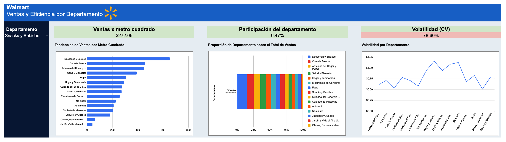

# Walmart Department Sales & Efficiency Analysis

**Business question:** Walmart operates hundreds of departments across stores of different sizes. Which departments are actually driving revenue, and which ones are occupying valuable floor space without delivering proportional results?

## Context

This analysis evaluates 2012 department-level sales performance to identify each department's contribution to the business and its space efficiency, serving as a foundation for commercial decision-making.

## Process

Built a full analytical pipeline in Google Sheets, from raw data to executive dashboard: cleaned the data, joined department and store catalogues, validated data quality, defined KPIs, and built an interactive dashboard that makes the findings immediately actionable.

## Key findings

### Which department categories were most efficient at generating sales in 2012?

**KPI:** Sales per m²

**Context:** Department efficiency was analyzed using sales per square metre, to compare category performance independent of store size.

**Insight:** Despensa y Básicos, Comida Fresca, and Artículos del Hogar y Papel show the highest sales per square metre, indicating more efficient use of available space compared to other categories.

**Implication:** Prioritizing these categories in space allocation, or replicating their commercial practices, could increase total sales without expanding store footprint.

### Which departments contributed most to the business, and which underperformed relative to their potential?

**KPI:** Department participation (% of total sales)

**Context:** Each department's share of total 2012 sales was evaluated to identify which categories carry the most weight in the business and which show a smaller contribution.

**Insight:** Despensa y Básicos, Comida Fresca, and Artículos del Hogar y Papel concentrate the largest share of total sales, while Jardín y Vida al Aire Libre and Oficina, Escuela y Manualidades show reduced participation and relatively weaker performance. Additionally, department code 16 represents 5.27% of 2012 sales but appears as "No existe" in the report, since it has no matching name in the department catalogue (raw_departamento only contains codes 1 through 14).

**Implication:** Departments with low contribution and low efficiency represent opportunities for improvement through adjustments in space, assortment, or commercial strategy, while high-contribution departments should be maintained as core pillars of the business. Additionally, the data team should update the master department catalogue to include code 16, to avoid leaving 5.27% of sales unclassified in executive reporting.

## Dashboard

Interactive dashboard filterable by department, showing sales per m², participation %, and sales volatility (coefficient of variation) side by side.

## Technical details

### File structure

| Sheet | Description | Type |
|---|---|---|
| raw_ventas | Original weekly sales data by store and department | Raw Data |
| raw_departamento | Department catalogue with names | Lookup |
| raw_tiendas | Store catalogue with type (A/B) and size in m² | Lookup |
| clean_ventas | Cleaned data with catalogue joins, standardised week, and department name | Clean Data |
| Pivot | Dynamic tables with aggregated metrics by department | Pivot Tables |
| Dashboard | Interactive widget to filter by department, showing KPIs, charts and visualisations | Dashboard |
| Resumen | Synthesis of findings, insights and business implications | Analytical Summary |

### KPIs & formulas

| KPI | Description | Formula | Interpretation |
|---|---|---|---|
| Sales per m² | Sales adjusted by store size | Total Sales / Store Size | Higher values indicate greater efficiency per square metre |
| Participation % | Each department's proportion of total 2012 sales | Dept Sales / Total Sales | High values = greater contribution to total revenue |

### Data quality checks

| Check | How it was verified | Formula | Result |
|---|---|---|---|
| Records without a matched department | Filtered the Dept column for blank values | `=CONTAR.SI(clean_ventas!I:I,"No existe")` | 6,435 |
| Negative or null sales | Searched for values < 0 using COUNTIF | `=COUNTIF(clean_ventas!D:D,"<0")` | 27 |
| Store sizes with value 0 or blank | Checked for zero or blank values | `=COUNTIF(raw_tiendas!C2:C46,0)+COUNTBLANK(raw_tiendas!C2:C46)` | 0 |

## Tools

Google Sheets · VLOOKUP · Pivot Tables · COUNTIF · Dashboard Design · Data Quality Validation · Data Governance

## Dataset

This project lives entirely in Google Sheets. See the interactive file below.

Full interactive file: [View on Google Sheets](https://docs.google.com/spreadsheets/d/1-QXNf5ENdyKSFaGZ_Qy1MbOCtjrnknMW/edit?usp=sharing&ouid=106602298566061042272&rtpof=true&sd=true)

---

By Deborah Jara | Business Intelligence · Data Analytics | Mexico
[LinkedIn](https://www.linkedin.com/in/deborahjara) · [GitHub](https://github.com/DebbieJara)
